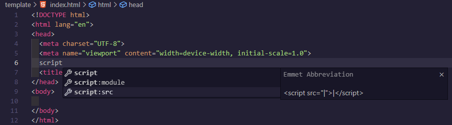
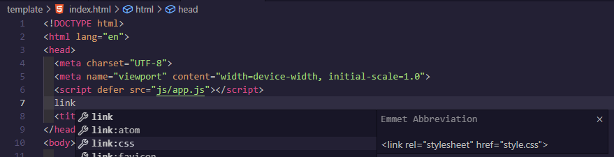

# How to Write HTML Boilerplate


## Step 1:
You can't write any HTML without a .html file first, go ahead and *create* a file and name it index.html.

## Step 2:
Once you have an index.html, youre almost finished.
1. Enter the HTML file.
2. Type `!`, you should notice an autocomplete prompt.
3. Press `Enter`.
4. ???
5. Profit.

## Step 3:
Another common step you may take is adding a script for js code and a link for css code.

### Script:
To add a script link:
1. Navigate to the head block of your boilerplate.
2. Type `script`.
3. Select the autocomplete for `script:src` 
   - > 
4. In `src=""`, add the relative path to your javascript file if you have one.
5. Add `defer` in front of the `src`

Your final script link should look something like this:
```html
  <script defer src="js/app.js"></script>
```

### Link:

To add a css link, its the same process as a js script, but with the `link` keyword instead
1. Go to another newline in your `<head>`
2. Type `link`.
3. Select autocomplete for `link:css`.
   - > 
4. in `href=""`, add the relative path to your css file if you have one.
Your final css link should look something like this:
```html
  <link rel="stylesheet" href="css/style.css">
```
## Step 4:
Congrats! You're all set!
